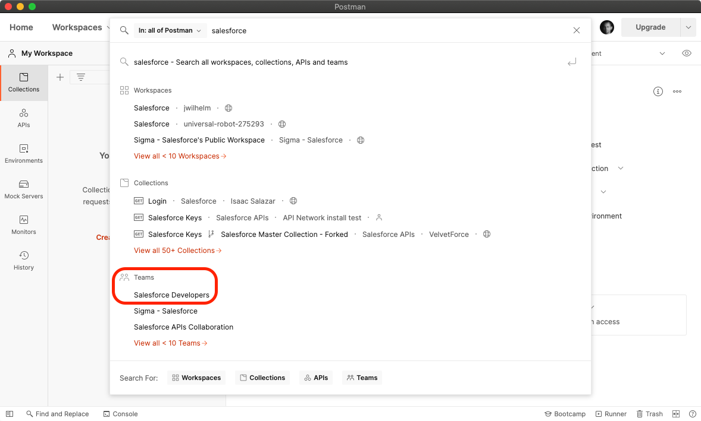

[Back to main page](README.md)

> Instructions updated for Postman desktop app v8

# Installing with the Postman Desktop App

This is the recommended installation option because it is the fastest to set up and doesn’t require changes on your Salesforce org.

- [Install the Postman App](#install-the-postman-app)
- [Fork the Collection](#fork-the-collection)
- [Configure the Collection](#configure-the-collection)
- [Authenticate with Salesforce](#authenticate-with-salesforce)
- [Execute a Request](#execute-a-request)

## Install the Postman App

Download and install the Postman app from [this link](https://www.postman.com/downloads).

### Fork the Collection

1. In the Postman desktop app, click on the top search bar and type **Salesforce**.
1. Click **Salesforce Developers** under Teams.

    

1. Click the **Salesforce APIs** tile.
1. Click **Fork**

    

1. Enter a label for your fork (e.g.: “My fork”).
1. Select a workspace (the default “My Workspace” workspace is fine).
1. Click **Fork Collection**.

## Configure the Collection

1. Click **Salesforce Commerce Cloud SLAS Use Cases**
1. Open the **Variables** tab.
1. Update the CURRENT VALUE with your values for public and private code verifiers and challenges.

The following variables should be setup as Postman environment variables before running any tests.

host - The host to the SLAS service. Should include https://
tenant_id - The tenand id that was created when SLAS and ECOM was set up.
base_uri - The base URI to SLAS. ex. /api/v1/organizations/
ocapi_uri - The uri to ECOM to access the OCAPI APIs. Should include https://
ocapi_site - The ECOM Site used in OCAPI calls. Ex. SiteGenesis or RefArch
ecom_customer_id - A customer (shopper) user from ECOM
ecom_customer_pw - A customer (shopper) user password from ECOM
private_client_id - The private client when client was created in SLAS.
private_client_secret - The private client secret when client was created in SLAS.
public_client_id - The public client when client was created in SLAS.
redirect_url - One of the redirect_uris that are part of the SLAS client.

1. Click **Save**.

## Authentication
For SLAS Authentication happens with the above mentioned public and private code verifiers and challenges.

## Execution
1. Expand the collection and select the `Guest User * Private Client > SLAS - Private Client - Guest Access Token` request.
1. Click `Send`.

At this point, if your environment is correctly set up, you should see a `200 OK` status. This means that you have successfully authenticated with Salesforce and that you can now use the other collection’s requests.

See [additional documentation](README.md#additional-documentation) for more information on how to keep the collection up to date and work with multiple Salesforce orgs.

[Back to main page](README.md)
